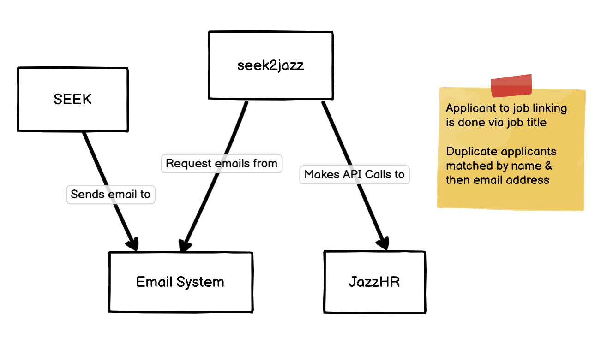

# Problem summary
Confirm high level design for seek2jazz

# Glossary
Applicant
: A candidate who has submitted a job application

seek2jazz
: The proposed name of the system being developed

SEEK email
: The email alert sent by SEEK when there is a new applicant for a job advertisement

JazzHR
: the system being used to managing the job hiring process

# Current solution

## General description
HR is currently importing SEEK job applicants using JazzHR's built in import tool. The general procedure for doing this is as follows:
1. Create job in JazzHR
2. Create advertisement in SEEK
3. Create email alert in SEEK using the generated email address in JazzHR's [import via email feature](https://help.jazzhr.com/s/article/Uploading-and-Importing-Candidates#email)

The system looks as follows:

## Disadvantages
The current process suffers from the following issues:
1. JazzHR assumes each document represents a new applicant. When a SEEK alert has both a cover letter and resume, two applicants are created in JazzHR
2. It appears JazzHR does some rudimentary parsing of the attachment to extract applicant metadata. This process is not produce reliable results
3. Manually duplicated information in the JazzHR job and in the SEEK advertisement

# Proposed Solution - seek2jazz via email system

## General description
This solution treats each SEEK's alert email as a task to synchronize the applicant into JazzHR. The general HR procedure for interacting with this system is as follows:
1. Create job in JazzHR
2. Create advertisement in SEEK with the same job title
3. Create email alert in SEEK using a specified email address. E.g. seek2jazz@terem.com.au

When an applicant submits their application:
1. SEEK sends an email to the seek2jazz email address, attaching the resume and cover letter details
2. seek2jazz checks the email address and detects the SEEK email 
3. seek2jazz creates a new applicant in JazzHR for the matching job using the details in the SEEK email

The system looks as follows:

## Advantages
1. No need to integrate with the SEEK API directly
2. Tooling for email system integration very mature and reliable
3. Allows gradual rollout of seek2jazz system. HR can gradually transition to seek2jazz by choosing which SEEK advertisements to send to the seek2jazz email address

## Disadvantages
1. Updates in SEEK email alert format may break the system in the future
2. SEEK advertisement to JazzHR job mapping via job title may be unreliable. Edge cases need to be accounted for:
    - When the job title in SEEK email not found in JazzHR
    - When the job title in SEEK email has multiple matches in JazzHR
3. Lower system reliability from increased number of components 

# Alternative solution 1 - seek2jazz via SEEK API

## General description
In this solution seek2jazz will directly call the SEEK and JazzHR APIs. Seek2jazz will detect new applicants via the SEEK API and create them accordingly via the JazzHR API. HR's procedure with this solution is as follows:

1. Create job in JazzHR
2. Create advertisement in SEEK

This system looks as follows:

## Advantages
1. No need to setup an email alert in the SEEK advertisement. One less step for HR
2. Future potential to automate more of the hiring process 
3. Allows for deeper data synchronization of applicant and job data
4. Simpler system architecture
5. No need to setup an email for seek2jazz

## Disadvantages
1. Code maintainers will need to be familiar with an additional API
2. Code will need to be updated when SEEK API changes

# Alternative solution 2 - Request fix from JazzHR

## General description
This solution involves asking JazzHR for a feature to handle cover letters properly. HR can then use JazzHR's feature directly without any issues

## Advantages
1. Saves development and maintainance time

## Disadvantages
1. JazzHR development team may choose not to develop this feature
2. JazzHR development team may not implement this feature in the near future